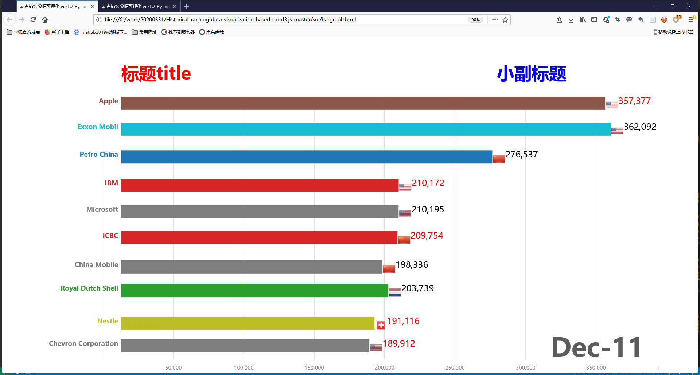

**本项目基于https://github.com/Jannchie/Historical-ranking-data-visualization-based-on-d3.js，针对以下五点问题进行了改动**

### 问题1
国旗不显示的原因是因为type字段没有在config.imgs的键中，比如说United Kindom。解决办法就是在config.imgs中加入没有出现的type对应的键值对。因为键不能带空格，所以在访问config.imgs对输入的键做去除空格处理。

### 问题2
柱形图是和这两个变量相关,barEnter和barUpdate，这两个变量对应的是两个数组，位置改动的话需要我把数值位置写到了配置文件里可以调动，实际上就是先获取数值的大小，然后位置就是在数值大小再加上一个正直就相当于在柱子右边了。国旗位置直接设置为0+数值大小。

改柱子成方形比较好改，但是改国旗的时候如果也改成方形的话，后面barupdate是通过select("rect)和selct("circle")来实现的，因此这里需要加一个id属性来区分两个元素，或者还有一个办法是判断index来区分两个rect元素，我选用的是第一种方法。

### 问题3
我在text元素那里加了一个font-family属性，但是我自己也对比不出来，这块需要确定一下字体改的是否是对的。

### 问题4
改config.js下的itemLabel和typeLabel

### 问题5
目前柱子的颜色和Name的颜色是一致的。加了显示数值的颜色，修改config.js下的number_color数组，目前的逻辑就是从上到下循环将数组中的颜色赋值给bar。修改主标题颜色和副标题颜色分别是修改config.js下的item_color和type_color。

#### 效果图
